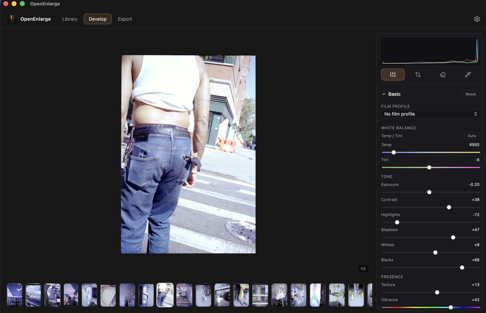

<div align="center">


# OpenEnlarge

**Develop your film negatives with real physics — not a flipped tone curve.**

[](LICENSE)
[](https://github.com/mohaelder/openenlarge/releases/latest)

[](https://github.com/mohaelder/openenlarge/actions/workflows/ci.yml)

[Download](https://github.com/mohaelder/openenlarge/releases/latest) · [Website](https://mohaelder.github.io/openenlarge) · [How it works](#how-it-works)

</div>



## What is OpenEnlarge?

OpenEnlarge is an open-source desktop darkroom for color film negatives. It inverts and develops scans of negatives into finished positives — the job a darkroom enlarger does for optical prints.

Most tools treat a negative scan as a generic image and fit tone curves to flip it. OpenEnlarge instead works in the **density domain**, using a Beer-Lambert model of how dye layers absorb light. Density is *linear* in dye concentration; transmittance is not — which is exactly why a naive invert-and-flip looks wrong. OpenEnlarge restores each channel's density relative to the measured film base, anchors it to the roll's density range, and prints back to a positive — then lets you finish on top.

> Every image is developed with the Kodak Cineon density inversion (darktable's `negadoctor` model), anchored on a per-roll film-base sample — a physically-based engine, not a flipped tone curve.

## Negative → Positive

| Negative (scan) | Developed (OpenEnlarge) |
|---|---|
|  |  |

## Features

- **Cineon density inversion** — physically-based Beer-Lambert engine (Kodak Cineon / `negadoctor`), one consistent path for every frame — not a flipped curve
- **Automatic film-base detection** — finds the orange-mask rebate and samples it as a single coherent clear-film color; auto-derives the roll's density range (`D_max`)
- **Crop-aware analysis** — base and density range are measured *inside* your crop, so the black surround and rebate of a camera scan never wash the image out
- **Automatic negative/positive detection** — every frame is classified on develop; negatives are inverted, positives pass through untouched (with a one-click override either way)
- **Measured white-point picker** — pin `D_max` precisely from a clear-leader patch by clicking it in the live viewport (also in the CLI via `--white-rect`)
- **Decodes RAW, TIFF, JPEG & PNG** — Fuji RAF, Panasonic RW2, Nikon NEF, Sony ARW, Canon CR3, Hasselblad 3FR and DNG, plus 16-bit TIFF, JPEG and PNG → linear RGB
- **Tethered shooting** — watch a folder and auto-import + develop new scans as they land, so finished positives appear as you shoot ("shoot & see")
- **Per-roll base calibration** — the film base is locked once per roll; recalibrate by dragging over a clear-film area, or pick a neutral with the gray-point tool
- **Full develop controls** — tonal curve, color grading, color wheels, exposure/black/gamma — with copy/paste of tone & color settings between frames (`Cmd/Ctrl+C` / `Cmd/Ctrl+V`)
- **Tone Matching** — match the toning of a frame to any reference image, with adjustable strength
- **AI Enhance** — one-click enhancement via OpenAI (`gpt-image-2`); bring your own API key in Settings
- **Local upscaling** — on-device 4K/8K upscaling with a tiled ONNX engine; models download on demand, no cloud round-trip
- **AI Dust & Hair Removal** — automatic defect detection (BOPBTL) plus MI-GAN inpainting, also available as an AI-fill eraser: paint a mask and apply a single, undoable AI erase
- **Crop, rotate, straighten, flip** with a live viewport and histogram
- **Batch export** to 16-bit TIFF / PNG / JPEG — with an optional batch crop applied across the whole selection in one pass
- **Library** — import a folder (optionally omitting preview JPGs) and remove folders from a right-click menu
- **HDR preview & export** *(experimental)* — toggle any frame into true HDR; highlights glow beyond SDR white on HDR-capable displays, and the frame exports as a gain-map HDR JPEG that matches the preview
- **In-app updates** — checks on launch or on demand from Settings and installs the new version in place
- **Headless CLI** (`film-cli`) for scripting and batch inversion
- **Cross-platform** — macOS, Windows, Linux, built on Tauri

> **HDR is experimental.** The in-app HDR preview lights up on HDR-capable displays (verified on macOS; likely on Windows; Linux falls back to the SDR image with no loss). HDR export is gain-map JPEG only — TIFF and PNG stay SDR — and the develop sliders don't yet edit *into* the HDR headroom. That deeper HDR-aware editing is coming next.

## Architecture

| Component | Path | Responsibility |
|---|---|---|
| `film-core` | `crates/film-core` | Pure Rust engine — decode, Cineon density inversion, base/density calibration, export. No UI deps. |
| `film-cli` | `crates/film-cli` | Headless CLI over `film-core` for batch/scripted inversion. |
| App shell | `app/` | Tauri 2 + SvelteKit UI wrapping `film-core`. |

## Download

Grab the latest installer for your OS from the [**Releases page**](https://github.com/mohaelder/openenlarge/releases/latest):

- **macOS** — `.dmg` (Apple Silicon)
- **Windows** — `.msi` or `.exe`
- **Linux** — `.AppImage` or `.deb`

## Build from source

**Prerequisites:** [Rust](https://rustup.rs) (stable), [Node.js](https://nodejs.org) ≥ 18, and the [Tauri prerequisites](https://v2.tauri.app/start/prerequisites/) for your OS (on Linux: `libwebkit2gtk-4.1-dev`, `libgtk-3-dev`, `librsvg2-dev`, `libappindicator3-dev`, `patchelf`).

```bash
# Run the desktop app in dev mode
cd app
npm install
npm run tauri dev

# Build a release installer for your OS
npm run tauri build
```

## CLI usage

The engine also runs headless. From the repo root:

```bash
# Invert a scan with the Cineon density engine → 16-bit TIFF
cargo run -p film-cli -- input.tiff -o output.tiff

# Sample the film base from a clear-rebate rect (x,y,w,h) and adjust print exposure (EV)
cargo run -p film-cli -- input.tiff -o out.tiff --base-rect 0,0,128,128 --exposure 1.0
```

Run `cargo run -p film-cli -- --help` for all options.

## How it works

A developed color negative is three stacked dye layers (Cyan, Magenta, Yellow) over an orange base. A scan is the forward model:

```
I_i = ∫ L(λ) · S_i(λ) · 10^(−D(λ)) dλ          (spectral integration)
D(λ) = D_min(λ) + Σ_j C_j · D_j(λ)              (Beer-Lambert: density linear in dye conc.)
```

OpenEnlarge inverts this with the **Kodak Cineon densitometry model** (the same math as darktable's `negadoctor`). Per channel, working from the measured film base `D_min` and the roll's density range `D_max`:

```
t   = I / D_min                                  transmittance relative to the clear base (mask removed)
p   = print_exposure · (1 + paper_black − t^(1/D_max))    density → positive linear "print"
out = (p · wb)^paper_grade                       white balance as a print-side gain, then the paper tone
```

with a highlight soft-clip on the result. Two ideas make the color come out right:

- **The film base does double duty.** `D_min` is sampled once per roll as a single *coherent* clear-film color (a real RGB value, not three independent per-channel percentiles). Dividing by it removes the orange mask **and** neutralizes the scanner/light-table illuminant in one step — so "base" and roll-level white balance stop fighting each other. It's detected automatically from the rebate, and re-derivable by dragging over any clear-film area.
- **White balance is a gain on the positive print, not a log-space offset on the negative.** Because `0 · wb = 0`, deep shadows stay neutral black instead of picking up a per-channel tint (the classic "yellow shadow" bug). Per-frame scene Temp/Tint and the gray-point picker ride on top of the roll-locked base.

Base and `D_max` are measured *inside the active crop*, so a camera scan's black surround and rebate never wash the image out. The deep version lives in [`docs/superpowers/specs/2026-06-07-negadoctor-inversion-design.md`](docs/superpowers/specs/2026-06-07-negadoctor-inversion-design.md) and the [golden-path spec](docs/superpowers/specs/2026-06-15-golden-path-inversion-spec.md).

## Telemetry

OpenEnlarge can send **anonymous, opt-in** usage analytics via [Aptabase](https://aptabase.com) (an open-source, privacy-first analytics tool). It is **off by default** — on first launch you're asked once, and you can change the choice anytime under **Settings → Anonymous analytics**.

When enabled, we record only:

- **Which features get used** — events like `app_launched`, `images_developed` (with a count), `images_exported` (count + format).
- **App version and OS**, attached automatically by Aptabase.

We never send your **images, file names, file paths, or any personal information**, and there is no cross-session identifier that can be traced back to you. Nothing is transmitted unless you opt in — the consent gate is enforced in the Rust backend, not just the UI. The collection code is right here in the open: [`app/src-tauri/src/telemetry.rs`](app/src-tauri/src/telemetry.rs) and [`app/src/lib/telemetry.ts`](app/src/lib/telemetry.ts).

**Want to see the numbers?** In the spirit of an open project, the aggregate dashboard is available on request — Aptabase has no public-link option, so access is granted by invitation. [Request dashboard access](mailto:calen0909@hotmail.com?subject=OpenEnlarge%20analytics%20dashboard%20access&body=Hi%2C%20I%27d%20like%20access%20to%20the%20OpenEnlarge%20analytics%20dashboard.%0A%0AName%20%2F%20GitHub%3A%0AReason%3A%0AEmail%20to%20invite%20%28Aptabase%20account%29%3A%0A%0AThanks%21) and you'll be invited manually.

## Roadmap

OpenEnlarge is actively developed. Next up:

- **Import Roll** — bring in a folder of scans as one roll that shares a single film-base calibration and density range across every frame.
- **Improve HDR** — graduate HDR out of *experimental*: edit *into* the HDR headroom with the develop sliders, widen export beyond gain-map JPEG, and verify across more displays.

See [`ROADMAP.md`](ROADMAP.md) for the full picture, and [open an issue](https://github.com/mohaelder/openenlarge/issues/new) to shape what's next.

## Contributing

Issues and pull requests are welcome. Before opening a PR, run the same checks CI does:

```bash
cargo fmt --all --check
cargo clippy --workspace --all-targets
cargo test --workspace
cd app && npm run check && npm run test:unit
```

## Acknowledgments

Huge thanks to [**toonoumi**](https://github.com/toonoumi) — his project [**FreeCCR**](https://github.com/toonoumi/FreeCCR) was a great help in building OpenEnlarge.

## License

[MIT](LICENSE) © 2026 mohaelder
